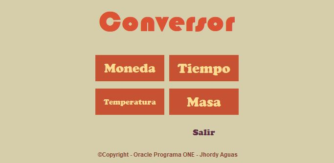
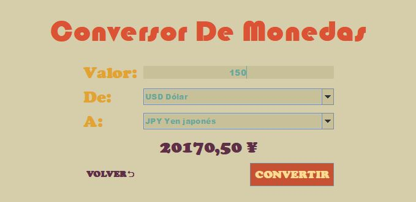
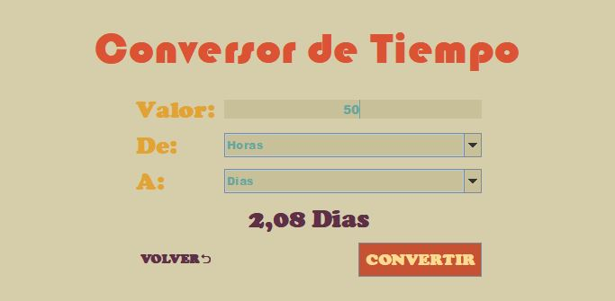
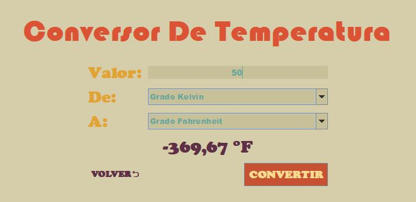
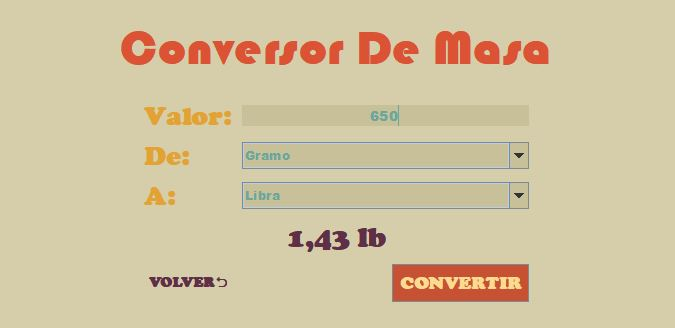

# Conversor de unidades
Este proyecto forma parte del quinto challenge del programa Oracle ONE.
Para el desarrollo del conversor se usó el estilo Modelo vista controlador (MVC).

####Uso
Su uso es simple.
1. Seleccionamos el tipo de conversor.
2. Ingresamos el valor a convertir.
3. Seleccionamos el tipo de unidades.
4. Y damos clic al botón CONVERTIR.

####Tipo de conversores implementados
- Monedas

- Tiempo

- Temperatura

- Masa

######Autor Jhordy
